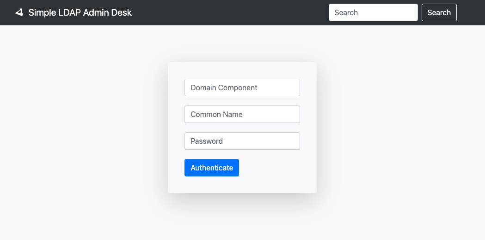

# Simple LDAP Admin Desk

[](https://will.bowxeon.com)

[](https://www.openldap.org/doc/admin24/)
[](https://docs.python.org/release/3.8.11/)
[](https://flask.palletsprojects.com/en/1.1.x/)
[](https://api.jquery.com/)
[](https://v4.bootcss.com/docs/getting-started/introduction/)
[](https://hub.docker.com/r/bxwill/ldapdesk)

#### Screenshot


#### Environment Variable Default Value

```text
LDAP_SERVER_HOST="127.0.0.1"
LDAP_SERVER_PORT=389
LDAP_SERVER_DOMAIN="QualitySphere.github.io"
```

#### ldap Operation

- https://ldap3.readthedocs.io/en/latest/searches.html